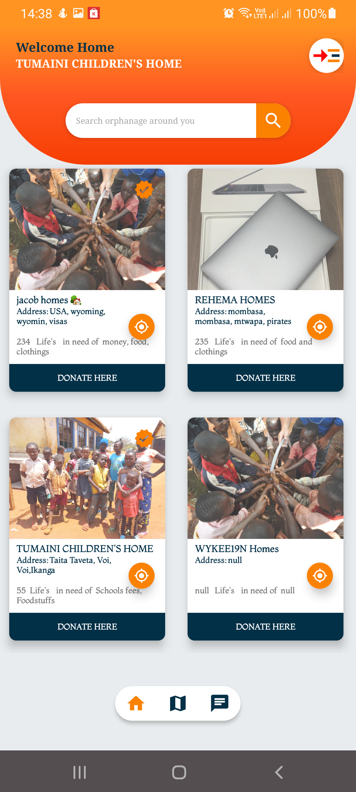

# SaveOne-Life

## Running the project
### Installation by Downloading the APK
- To download the apk click the link [SaveOne-Life]()
- Install the apk on your android mobile phone
### Installation by Cloning to Android Studio
- Download Android Studio
- Clown the repo using the command ``` git clone https://github.com/wykeenjenga/SaveONE-life.git```
- Run the android app on Android Studio


## Impact
SaveOne-Life is an android mobile application that helps solve three United Nations  Sustainable Development Goals(SDG). These goals are;
> #### No-Poverty
> According to the United Nations, one out of five children live in extreme poverty, and the negative effects of poverty and deprivation in the early years have ramifications that can last a lifetime. With SaveOne-Life, donors can be able to explore and donate to orphanages that are facing extreme poverty. Some of the items that can be donated to reduce poverty include; clothings, better housing, beddings, etc.

> ### Quality Education
> To protect the well-being of children and ensure they have access to continued learning, the SaveOne-Life android application enables donors to search for orphanages and donate learning materials such as books, pens, and many more.

> ### Zero-Hunger
> Zero hunger is one of the United Nations SDGS. To enhance and maintain zero hunger among the young generation, SaveONE life provides a platform whereby donors can donate food stuffs to the affected orphanages.

## Scalability of the project.
> SaveONE Life project is scalable,
> If we were to continue, we were to implement addition feature regarding the health of the childrens, whereby Orphan keeper will have to add and Indicate the number of childrens who are not in good health, this also will lead to additional integration with good willing health Sectors. Health Sector will be able to login to the app and locate those poor childrens that are in need.

> Most orphanages in Kenya are founded and run by individuals, not the government. and most wealthiest families have a tendance of adopting 1 or 2 childrens from the orphanage and help them either by educating them and many more. But some families they do adopt the childrens and mistreate them. In future we are planning to add more features whereby the app will be tracking the progress and the number of childrens whom are adopted, including the location and lifestyle of the childrens. This feature will help Orphanage Masters to track the well being of their childrens.

> M-Pesa is a virtual banking system that provides transaction services through a SIM card. Once the SIM has been inserted into the card slot of the mobile device, users can make payments and transfer money to vendors and family members with SMS messages. In future we are planning to integrate mpesa APIs with our app, so that it can be easy for donors to donate with mpesa with a single touch from the app.

## App Testing.
> We tested SaveONE-life App with two childrens home as shown on the screenshoots below. They were very excited because they will be able to express their needs throught SaveONE life, for the real experience you can download SaveONE life from [Set Up](#SaveOne-Life)
> 
> 

## TECHNOLOGY
SaveOne-Life is an android mobile application developed using Android Studio, Programming language used is JAVA.

>### 


## Licences

## Thanks <span style="color: #fb8100;">&hearts;</span>
Thanks to Google Developer Students Club for contributing towards the growth of [@DSCTTU](https://twitter.com/DscTtu?t=nLFp2oGleW6Tpu3XpzbugQ&s=09).
